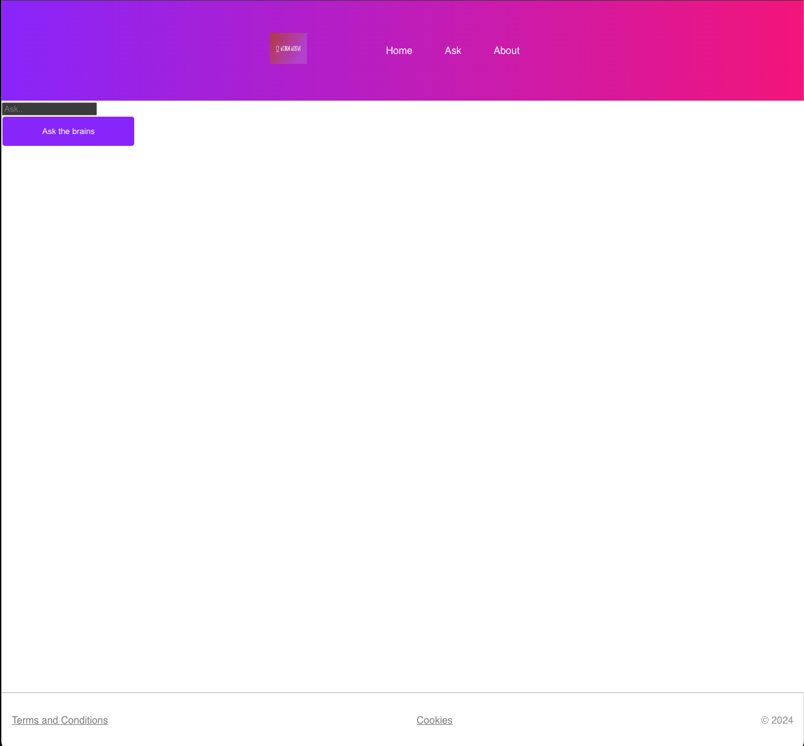
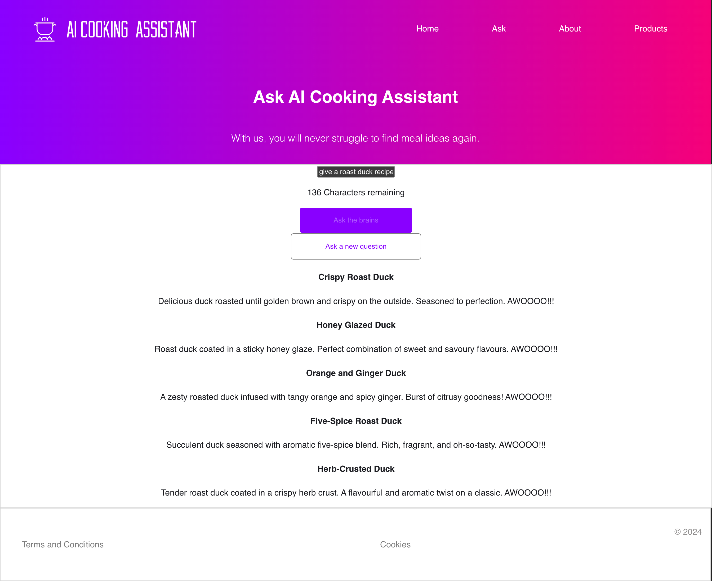
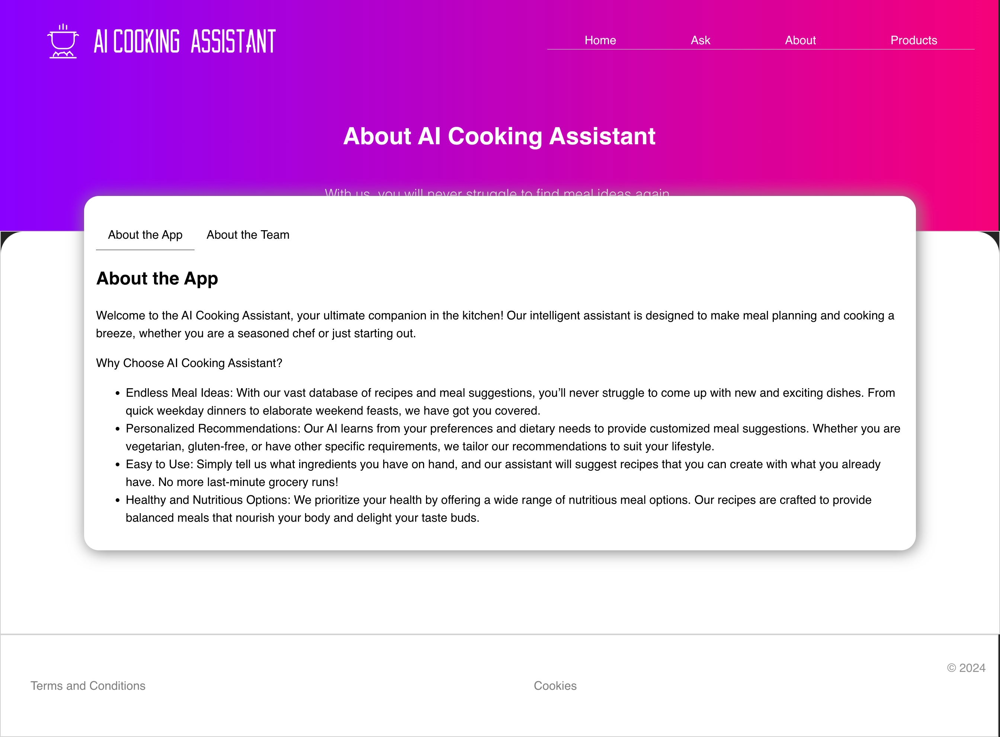
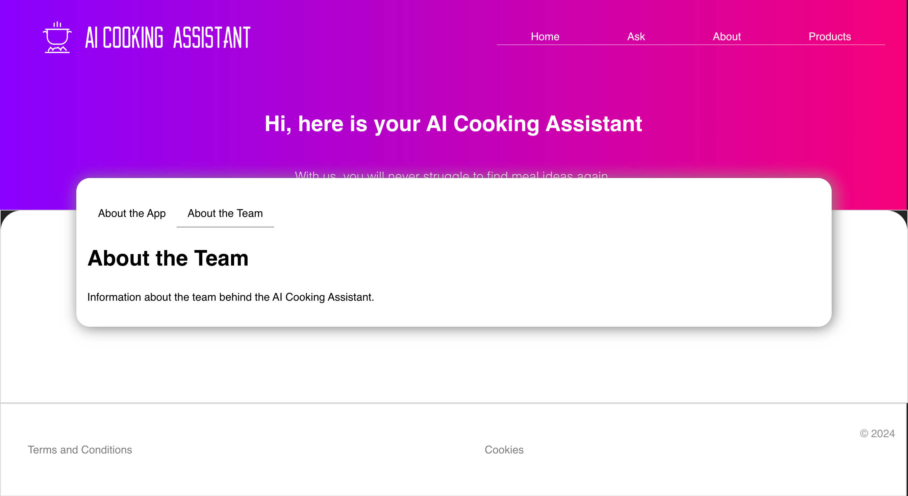
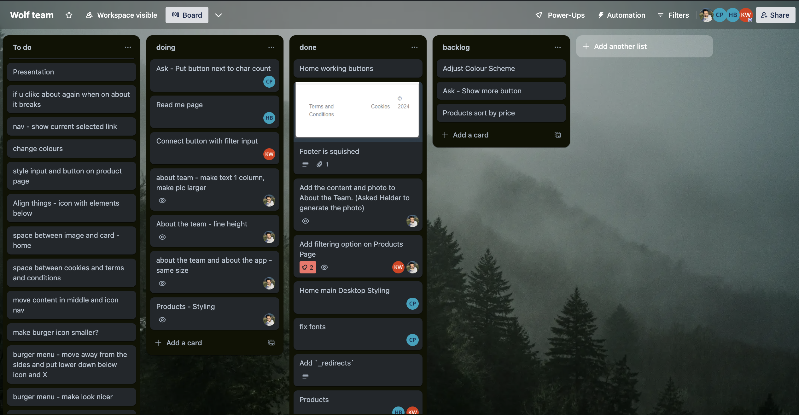
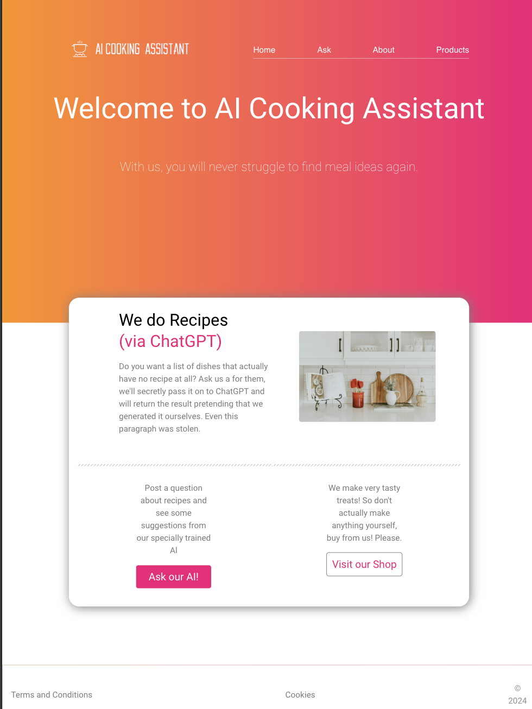
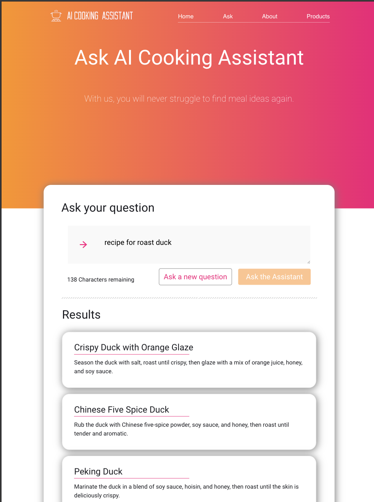
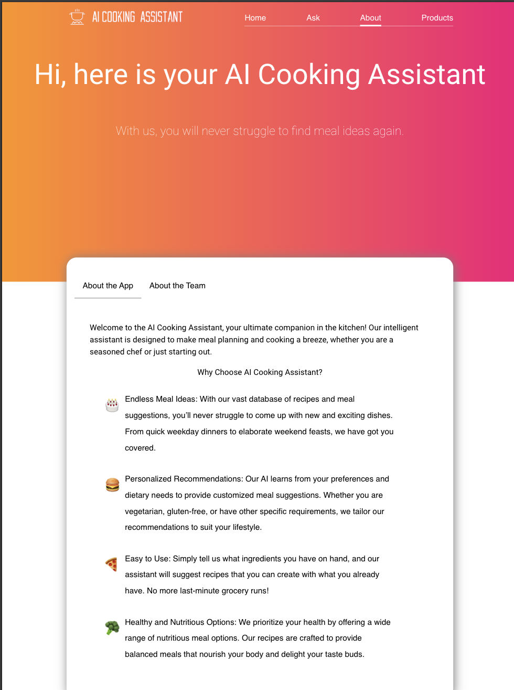
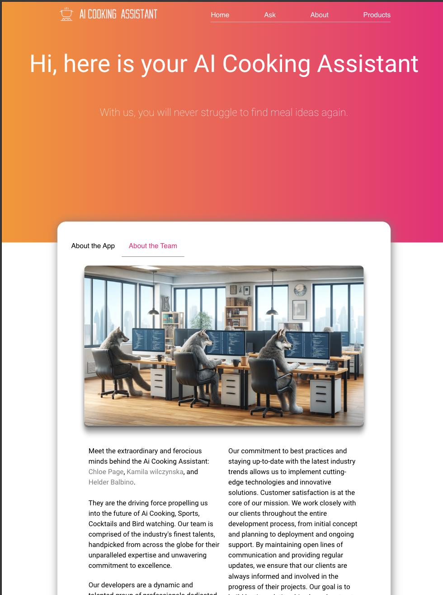
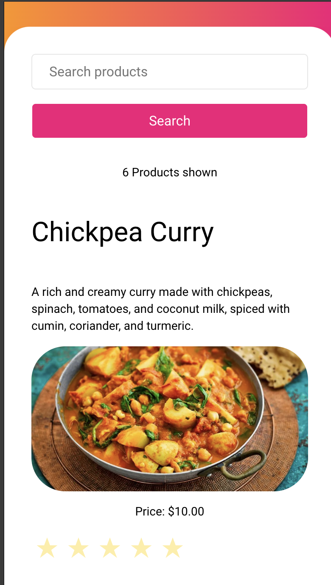

# Ai Cooking Assistant

This was the second group project completed while being a trainee web developer at TechNative Academy.

## Table of Contents

- [Ai Cooking Assistant]()
  - [Description](#description)
  - [View Project](#view-project)
  - [Our Journey](#our-journey)
  - [Our Stack](#our-stack)
  - [Installation](#installation)
  - [Usage](#usage)
    - [As a user](#as-a-user)
  - [License](#license)
  - [Contributing](#contributing)
    - [Chloe Page](#chloe-page)
    - [kamila wilczynska](#kamila-wilczynska)
    - [Helder Balbino](#helder-balbino)
  - [Tests](#tests)
  - [Questions](#questions)

## Description

Welcome to AI Cooking Assistant – your ultimate culinary assistant! Our app harnesses the power of AI to bring you personalized cooking recipes tailored to your taste preferences, dietary needs, and ingredient availability. Whether you're a seasoned chef or a kitchen novice, AI Cooking Assistant provides step-by-step instructions, smart suggestions, and creative culinary inspiration to make cooking fun and easy. Discover new flavors, experiment with diverse cuisines, and transform everyday meals into gourmet experiences. Let's cook up something amazing together!

## View Project

https://ai-cooking-assistant.netlify.app/

## Our Stack

- React:
we decided to use React as it is a great choice for this type of web app due to it's component-based architecture and
ease of use.
- Redux:
To fetch API  and display products and get the response of AI

## Our Journey

Day 1

On the 1st day we were given a detailed overview about the project and a figma wireframe with the webapp's design.

Our task was to create our own  AI company and use the provided design to create our webapp.

So first day included figuring out the name of our app and what it would be about:
We decided to create a webapp related to the culinary field.
Also, we discussed how were going to approach the task, where we came to the conclusion that we would split the project into sections and create trello tickets for each task, as shown bellow.

### Trello Board

Already on the first day we implemented some of the amazing designs we had in mind.

With a mobile first approach, since we believe most of our users would use our app on the go.
(E.g. busy person could look up a recipe on their way home and buy the ingredients before they get there.)

### Home:

#### Mobile view:

### Desktop view:

Day 2

On the 2nd day we added a our second page that would provide the user with a text box to input their recipe query.

#### Ask page:

### mobile view:

Day 3

On the 3rd day, we added a new page to our app that would provide users with information about our app and our team. Additionally, we created a products page to display a variety of dishes, complete with a star ratings system and prices. We also improved the design of the app to make it more user-friendly and visually appealing.

### Home and Ask page Improved design:

### About App and About Team Pages:

### Products Page:

Day 4

On the fourth day, we aimed to enhance the app’s design even more. So we sought feedback from our design team and friends, generating additional tickets on our Trello board.

Day 5

 On the 5th day we implemented the design changes to our app. Giving us the final product that would be ready to go live.

### Home:

### Ask page:

### About App and About Team Pages:

### Products Page:

## License

  

## Contributing

### [Chloe Page](https://github.com/ChloeSAPage)

### [kamila wilczynska](https://github.com/kamila-wilczynska)

### [Helder Balbino](https://github.com/HelderBalbino)

## Questions
  Please reach out if you have any questions.
